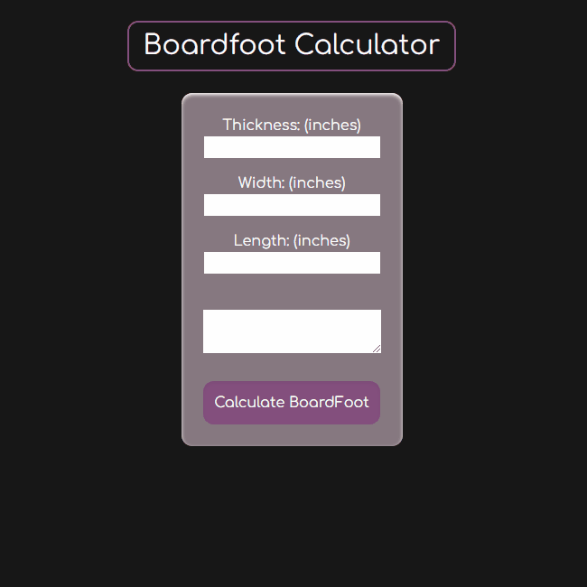

# Boardfoot Calculator
---
## Description
Simple calculator to plan how much lumber you will need for a project

---

## Instructions
Enter values(in inches) in "Thickness", "Width", and "Length"

Click "Calculate BoardFoot" button to see those values returned as the bdft you'll need.

---

## Demo

---
## Link
https://mahiv87.github.io/boardfoot-calculator/

---